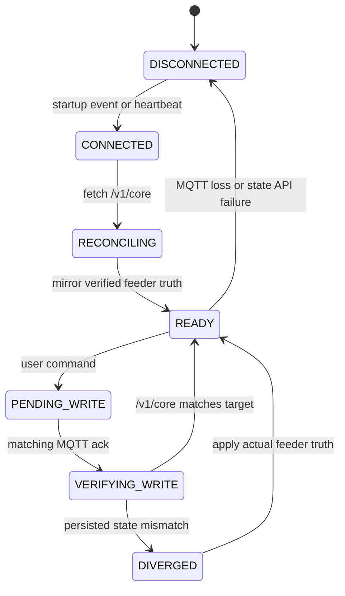

# Architecture

Petlibro Local is a backend boundary. It packages local device protocols and
media transport but does not provide the future Home Assistant frontend
integration.

```mermaid
flowchart LR
    UI[Future HACS integration] -->|Stable MQTT contracts and commands| Broker[MQTT broker]
    UI -->|RTSP / WebRTC / API| Go2rtc[Patched go2rtc]

    subgraph Backend[Petlibro Local backend]
        Discovery[Discovery coordinator]
        Registry[Private device registry]
        Controller[PLAF203 AppDaemon controller]
        Truth[Feeder state coordinator]
        Go2rtc
        Status[Per-stream camera status JSON]
    end

    Broker -->|Topic serial and DEVICE_START_EVENT UID| Discovery
    Discovery -->|Atomic identity and IP mapping| Registry
    Discovery -->|LAN_SEARCH3 UID lookup| Feeder
    Registry -->|Direct-IP stream config| Go2rtc
    Go2rtc -->|Runtime state, SPS, and health| Status
    Status -->|Health and address refresh trigger| Discovery
    Status -->|Validated per-stream polling| Controller
    Controller <-->|Local PLAF203 MQTT protocol| Broker
    Controller --> Truth
    Truth -->|Read-only revisions and core state| StateAgent[Feeder state agent]
    StateAgent -->|Decodes local state files| Feeder
    Controller -.->|Explicit validated endpoint update only| Feeder
    Controller -->|Retained camera state and availability| Broker
    Broker <-->|Redirected plaintext MQTT| Feeder[PLAF203 feeder]
    Go2rtc <-->|LAN UDP/TUTK camera protocol| Feeder
```

## Runtime components

### Patched go2rtc

The imported go2rtc source registers the `petlibro://` stream scheme. It handles
LAN discovery or a fixed feeder address, the camera handshake, stream control,
media-window ACKs, alternate media headers, H.264/AAC assembly, and RTSP/WebRTC
output.

### AppDaemon controller

The controller connects to the configured MQTT broker through AppDaemon's MQTT
plugin. It responds to the feeder's PLAF203 protocol, publishes Home Assistant
MQTT discovery entities, accepts commands through its own MQTT topics, and
publishes the stable camera runtime contract for frontend integrations.
Its broker connection settings are separate from the opt-in feeder endpoint
persistence settings. Normal startup acknowledges the feeder without sending
an endpoint sync. An explicitly enabled update is allowed only after the
feeder-facing host resolves outside Home Assistant's internal networks and its
MQTT port accepts a bounded TCP connection.

Persistent control is split between the MQTT adapter and a single state
coordinator. The adapter encodes commands and correlates acknowledgements; it
does not own setting or plan truth. The coordinator alone owns the last
verified `/v1/core` model and revisions, projects that truth into Home
Assistant under a writeback-suppression guard, and serializes persistent
writes.

The feeder agent classifies decoded `state.bin` fields as persistent
configuration, effective cached state, or runtime telemetry. Persistent switch
bytes are authoritative for command verification. Adjacent firmware-calculated
`enableX` cache bytes remain diagnostic only even when they happen to agree.
Meal Call enablement additionally carries the fresh persistent `audio_url`
from that same feeder truth response because firmware requires both fields in
one attribute command; retained Home Assistant text is never used.

Heartbeat processing sends the existing feeder protocol traffic and uses
`/v1/rev` as the inexpensive change detector. Full core reads occur on initial
reconciliation, a revision change, plan preflight, plan-response requests, and
write verification. An MQTT acknowledgement never mutates local truth by
itself. API loss marks persistent state unavailable and blocks writes instead
of promoting retained Home Assistant state.

Dispensing status has a separate runtime truth path. On the first feeder
heartbeat, after a feeder reconnect, and when Home Assistant publishes
`homeassistant/status = online`, the controller sends one correlated
`ATTR_GET_SERVICE` request. A matching response maps live firmware
`motorState` values to Idle (`2`), Dispensing (`1`), or Recovering (`3`). Values
such as `0`, malformed responses, and timeouts leave only this entity
unavailable. Subsequent `GRAIN_OUTPUT_EVENT` START, BLOCKING, and END messages
drive the immediate Dispensing, Blocked, and Idle transitions.

The controller records the feeder connection generation, request `msgId`, and
local grain-event generation for each runtime request. A response from an old
connection, a response for another request, or a response overtaken by a grain
event cannot overwrite newer runtime evidence. `Recovering` is distinct from
`Blocked`: the former is the firmware's active recovery state, while the latter
is the immediate reported grain-output event.

`food_output/progress` and its dedicated availability topic are intentionally
non-retained and are replayed only after fresh feeder evidence. The historical
last-dispense start, end, portion count, and trigger topics are retained because
they are durable last-known observations. Home Assistant birth also republishes
discovery, current controller availability, and the coordinator's latest
verified feeder truth; none of those retained or cached HA values are consumed
as feeder truth.

The State Agent remains file-backed. Its `/v1/core.motor_state_raw` value is an
opportunistically persisted runtime cache and is not used to reconstruct current
dispensing state. Direct motor GPIO is also unsuitable: firmware can
intentionally stop the motor for roughly 950 ms during an active dual-bowl
transition, so a stopped pin sample does not prove that the feed state machine
is idle.

### State Agent OTA boundary

Optional State Agent OTA is intentionally separate from feeder-truth
reconciliation. AppDaemon downloads `latest.json`, `latest.json.sig`, and, only
for an explicit install request, the artifact over HTTPS. It verifies the
64-byte detached Ed25519 signature over the exact raw manifest bytes before
strictly parsing the manifest and checking the artifact's SHA-256 and size. The
repository's sole trust-anchor source is
`feeder-state-agent/release-public-key.hex`; the add-on image packages that
public key for the verifier and the feeder binary embeds it at build time.
That file names the candidate embedded trust anchor for the next State Agent
build, while the private signer that authorizes the current candidate is
separate.

Normal releases use matching signer and candidate keys and omit
`--rotate-trust-anchor`. Rotation releases deliberately pair candidate B in
`release-public-key.hex` with private A and pass `--rotate-trust-anchor` so the
current signer authorizes the transition candidate, and that candidate
independently embeds the next trust anchor. The tooling
reports SHA-256 fingerprints for the signer-derived public key and candidate
trust anchor; normal mode requires equality, rotation mode requires inequality,
and signature self-verification always uses the signer-derived public key.

The upload is a binary `PLAFOTA1` frame with three big-endian 32-bit lengths for
the raw manifest, 64-byte signature, and artifact. The authenticated feeder API
validates the signature first, then the exact schema, a strictly newer SemVer
version, artifact hash, size, and ARMv7 ELF shape. It stages only fixed paths
below `/user/data/local-state-agent/update`; neither release URLs nor commands
cross the AppDaemon-to-feeder boundary.

The manifest schema remains unchanged across trust-anchor rotation and carries
no replacement trust key. The next trust anchor stays compiled into the State
Agent executable, not supplied by the manifest or any online keyring.

The separate runit update supervisor owns service stop, atomic binary swap,
restart, version/health probation, and one rolling backup rollback. State Agent
staging and supervisor activation share the kernel advisory lock at
`/user/data/local-state-agent/update/transaction.lock`; conflicts return HTTP
409 instead of overwriting a live transaction.

Durable phases are `pending`, `activating`, `candidate_active`,
`probation_confirmed`, `rollback_in_progress`, and terminal `idle`,
`rolled_back`, or `failed`. The fixed-path `plaf203-update-fs` helper performs
same-directory temp writes/copies, file fsync, atomic rename, directory fsync,
and durable cleanup. A reboot from `candidate_active` restores only a validated
ARM ELF backup; `probation_confirmed` completes success; and
`rollback_in_progress` resumes rollback without retrying the failed candidate.
The existing State Agent bearer token and source-IP ACL
protect all update routes; there is no additional update token. The Home
Assistant Update entity and diagnostic check button are MQTT projections of
this subsystem. They neither participate in `FeederStateCoordinator` nor turn
MQTT delivery acknowledgement into durable feeder truth. During probation the
controller polls only the local feeder status, not the Internet release source.

For a single-key A→B rotation, the operational sequence is: A deployed State
Agent trusts A; B deployed AppDaemon trusts A; build a transition State Agent
with `release-public-key.hex=B`; sign the transition manifest with private A
plus `--rotate-trust-anchor`; existing AppDaemon A verifies; existing State
Agent A verifies; the candidate installs and now trusts B; confirm successful
probation and rollback no longer pending; update AppDaemon/package trust anchor
to B; future releases are signed by B normally. If a feeder misses the A→B
hand-off before AppDaemon moves to B, the recovery path is to temporarily run
an AppDaemon/release workflow that still trusts A or recover the feeder over
manual SSH before retrying.

Publication remains immutable artifact first, signed manifest second, with no
remotely supplied trust anchor and no online keyring.

Signed artifact/release URLs are HTTPS-only and reject credentials/fragments;
immutable artifact URLs also reject queries and require a concrete path.
Release metadata and artifact downloads reject redirects. Both Python and C
apply SemVer 2.0.0 precedence, ignoring build metadata. Accepted
State Agent sockets use a 30-second inactivity timeout while retaining
single-threaded request handling.

Feeding plans have no second cache in `Backend` or AppDaemon storage. Every
edit starts with a fresh core preflight and is sent as a full collection. The
target plan changes only in time, weekdays, portions, derived one-shot state,
and its per-update `syncTime`. Runtime `execution_state` and regenerated sync
metadata are excluded from schedule equality. `skip_end_time`, audio transport
fields, the opaque ten-byte tail, and all non-target plans are preserved and
included in post-ack collateral-mutation checks.

`/v1/feed-events` is a view of the feeder's 51-slot store-and-forward MQTT
queue. Each logical slot contains START, END, and BLOCKING subrecords. Firmware
clears acknowledged entries, so this endpoint is operational queue state and
must never be presented as durable feeding history.

The AppDaemon implementation follows the same boundaries in code:

| Module                            | Responsibility                                                          |
| --------------------------------- | ----------------------------------------------------------------------- |
| `plaf203.py`                      | Application lifecycle and component wiring                              |
| `state_agent.py`                  | Authenticated, read-only HTTP models and client                         |
| `state_coordinator.py`            | Truth, revisions, serialized writes, verification, and divergence       |
| `mqtt_client.py` / `protocol.py`  | Feeder MQTT transport and wire schemas                                  |
| `backend.py`                      | Protocol lifecycle, commands, acknowledgements, and telemetry callbacks |
| `settings_map.py` / `commands.py` | Declarative HA/semantic/wire mappings and user command routing          |
| `feed_plans.py`                   | Plan parsing, typed protocol serialization, and display projection      |
| `ha_entities.py` / `telemetry.py` | MQTT discovery, verified-state mirroring, and operational telemetry     |
| `dispensing_status.py`            | Fresh dispensing runtime state, ordering, and dedicated availability    |
| `storage.py`                      | Local manual-feed preference and stale diagnostics, never feeder truth  |
| `feeder-state-agent/`             | Strict binary decoder and feeder-resident read-only API                 |

### Discovery coordinator

The coordinator subscribes to `dl/+/+/device/#`, filters supported PLAF203
topics, derives the serial from the topic, and accepts a 20-character UID only
from `DEVICE_START_EVENT.uuid`. It calls the companion `petlibro-resolve`
binary, which reuses the Go Petlibro LAN_SEARCH3/KNOCK2 implementation instead
of duplicating it in Python.

The mode-0600 `/data/devices.json` registry is the durable source for generated
per-device AppDaemon entries and direct-IP go2rtc URLs. Writes are atomic and
allowlisted; broker credentials and product secrets cannot enter the registry.
Repeated events are debounced. The coordinator restarts only go2rtc and only
when the rendered `go2rtc.yaml` bytes change.

### Camera metadata bridge

Each Petlibro go2rtc client atomically replaces
`/data/petlibro_camera_status_<stream>.json` when lifecycle state, SPS
resolution, or health counters change. Its matching AppDaemon app polls this
internal file, validates and
allowlists its fields, merges configured product/stream information, and
publishes retained MQTT state only after a semantic change or heartbeat.

The file is a private service boundary. The versioned
[MQTT camera contract](mqtt-camera-contract.md) is the public interface for the
future HACS integration. Keeping MQTT publication in AppDaemon avoids giving
go2rtc broker credentials or coupling a frontend to go2rtc internals.

The renderer removes a previous session's status file when go2rtc starts, so
AppDaemon publishes offline until the new producer writes current evidence.

### Runtime configuration

Home Assistant stores add-on options in `/data/options.json`. Docker Compose
provides equivalent environment variables. `render_config.py` validates either
source and writes service-specific configuration atomically under `/data`.
One PLAF203 app and one stream are generated per sufficiently discovered
device; unresolved devices remain visible in readiness MQTT without producing
an invalid stream.

The services are independent s6 processes. A crash in one service does not
terminate or supervise the other in application code; s6 handles restart and
container shutdown behavior.

## Network boundaries

Host networking is used so UDP broadcast/LAN camera discovery and WebRTC behave
consistently. The AppDaemon controller reaches the broker over TCP, while the
camera client connects directly to the feeder on UDP port 32761.

The go2rtc web/API and media listeners are exposed directly on the host network.
They should be restricted to trusted clients outside the container.

## Source ownership

Both component trees are ordinary source files in this repository. There are no
Git submodules, subtrees, or runtime build references to the historical source
repositories.
