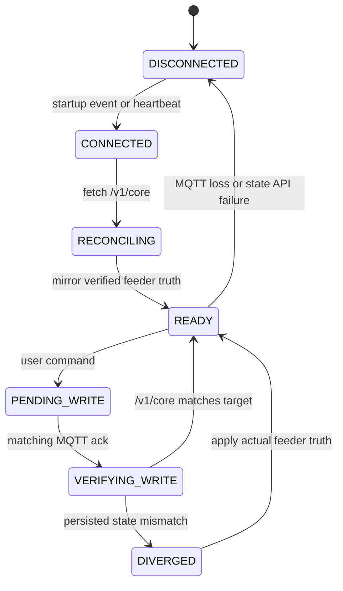

# Architecture

Petlibro Local is a backend boundary. It packages local device protocols and
media transport but does not provide the future Home Assistant frontend
integration.

```mermaid
flowchart LR
    UI[Future HACS integration] -->|Stable MQTT contracts and commands| Broker[MQTT broker]
    UI -->|RTSP / WebRTC / API| Go2rtc[Patched go2rtc]

    subgraph Backend[Petlibro Local backend]
        Discovery[Discovery coordinator]
        Registry[Private device registry]
        Controller[PLAF203 AppDaemon controller]
        Truth[Feeder state coordinator]
        Go2rtc
        Status[Per-stream camera status JSON]
    end

    Broker -->|Topic serial and DEVICE_START_EVENT UID| Discovery
    Discovery -->|Atomic identity and IP mapping| Registry
    Discovery -->|LAN_SEARCH3 UID lookup| Feeder
    Registry -->|Direct-IP stream config| Go2rtc
    Go2rtc -->|Runtime state, SPS, and health| Status
    Status -->|Health and address refresh trigger| Discovery
    Status -->|Validated per-stream polling| Controller
    Controller <-->|Local PLAF203 MQTT protocol| Broker
    Controller --> Truth
    Truth -->|Read-only revisions and core state| StateAgent[Feeder state agent]
    StateAgent -->|Decodes local state files| Feeder
    Controller -.->|Explicit validated endpoint update only| Feeder
    Controller -->|Retained camera state and availability| Broker
    Broker <-->|Redirected plaintext MQTT| Feeder[PLAF203 feeder]
    Go2rtc <-->|LAN UDP/TUTK camera protocol| Feeder
```

## Runtime components

### Patched go2rtc

The imported go2rtc source registers the `petlibro://` stream scheme. It handles
LAN discovery or a fixed feeder address, the camera handshake, stream control,
media-window ACKs, alternate media headers, H.264/AAC assembly, and RTSP/WebRTC
output.

### AppDaemon controller

The controller connects to the configured MQTT broker through AppDaemon's MQTT
plugin. It responds to the feeder's PLAF203 protocol, publishes Home Assistant
MQTT discovery entities, accepts commands through its own MQTT topics, and
publishes the stable camera runtime contract for frontend integrations.
Its broker connection settings are separate from the opt-in feeder endpoint
persistence settings. Normal startup acknowledges the feeder without sending
an endpoint sync. An explicitly enabled update is allowed only after the
feeder-facing host resolves outside Home Assistant's internal networks and its
MQTT port accepts a bounded TCP connection.

Persistent control is split between the MQTT adapter and a single state
coordinator. The adapter encodes commands and correlates acknowledgements; it
does not own setting or plan truth. The coordinator alone owns the last
verified `/v1/core` model and revisions, projects that truth into Home
Assistant under a writeback-suppression guard, and serializes persistent
writes.

Heartbeat processing sends the existing feeder protocol traffic and uses
`/v1/rev` as the inexpensive change detector. Full core reads occur on initial
reconciliation, a revision change, plan preflight, plan-response requests, and
write verification. An MQTT acknowledgement never mutates local truth by
itself. API loss marks persistent state unavailable and blocks writes instead
of promoting retained Home Assistant state.

Feeding plans have no second cache in `Backend` or AppDaemon storage. Every
edit starts with a fresh core preflight and is sent as a full collection. The
target plan changes only in time, weekdays, and portions; opaque raw fields and
all non-target plans are preserved and included in post-ack collection
verification.

The AppDaemon implementation follows the same boundaries in code:

| Module | Responsibility |
|---|---|
| `plaf203.py` | Application lifecycle and component wiring |
| `state_agent.py` | Authenticated, read-only HTTP models and client |
| `state_coordinator.py` | Truth, revisions, serialized writes, verification, and divergence |
| `mqtt_client.py` / `protocol.py` | Feeder MQTT transport and wire schemas |
| `backend.py` | Protocol lifecycle, commands, acknowledgements, and telemetry callbacks |
| `settings_map.py` / `commands.py` | Declarative HA/semantic/wire mappings and user command routing |
| `feed_plans.py` | Plan parsing, opaque-field preservation, serialization, and display projection |
| `ha_entities.py` / `telemetry.py` | MQTT discovery, verified-state mirroring, and operational telemetry |
| `storage.py` | Local manual-feed preference and stale diagnostics, never feeder truth |

### Discovery coordinator

The coordinator subscribes to `dl/+/+/device/#`, filters supported PLAF203
topics, derives the serial from the topic, and accepts a 20-character UID only
from `DEVICE_START_EVENT.uuid`. It calls the companion `petlibro-resolve`
binary, which reuses the Go Petlibro LAN_SEARCH3/KNOCK2 implementation instead
of duplicating it in Python.

The mode-0600 `/data/devices.json` registry is the durable source for generated
per-device AppDaemon entries and direct-IP go2rtc URLs. Writes are atomic and
allowlisted; broker credentials and product secrets cannot enter the registry.
Repeated events are debounced. The coordinator restarts only go2rtc and only
when the rendered `go2rtc.yaml` bytes change.

### Camera metadata bridge

Each Petlibro go2rtc client atomically replaces
`/data/petlibro_camera_status_<stream>.json` when lifecycle state, SPS
resolution, or health counters change. Its matching AppDaemon app polls this
internal file, validates and
allowlists its fields, merges configured product/stream information, and
publishes retained MQTT state only after a semantic change or heartbeat.

The file is a private service boundary. The versioned
[MQTT camera contract](mqtt-camera-contract.md) is the public interface for the
future HACS integration. Keeping MQTT publication in AppDaemon avoids giving
go2rtc broker credentials or coupling a frontend to go2rtc internals.

The renderer removes a previous session's status file when go2rtc starts, so
AppDaemon publishes offline until the new producer writes current evidence.

### Runtime configuration

Home Assistant stores add-on options in `/data/options.json`. Docker Compose
provides equivalent environment variables. `render_config.py` validates either
source and writes service-specific configuration atomically under `/data`.
One PLAF203 app and one stream are generated per sufficiently discovered
device; unresolved devices remain visible in readiness MQTT without producing
an invalid stream.

The services are independent s6 processes. A crash in one service does not
terminate or supervise the other in application code; s6 handles restart and
container shutdown behavior.

## Network boundaries

Host networking is used so UDP broadcast/LAN camera discovery and WebRTC behave
consistently. The AppDaemon controller reaches the broker over TCP, while the
camera client connects directly to the feeder on UDP port 32761.

The go2rtc web/API and media listeners are exposed directly on the host network.
They should be restricted to trusted clients outside the container.

## Source ownership

Both component trees are ordinary source files in this repository. There are no
Git submodules, subtrees, or runtime build references to the historical source
repositories.
