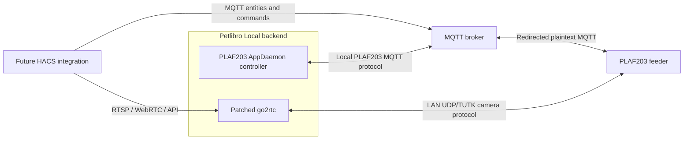

# Architecture

Petlibro Local is a backend boundary. It packages local device protocols and
media transport but does not provide the future Home Assistant frontend
integration.

## Runtime components

### Patched go2rtc

The imported go2rtc source registers the `petlibro://` stream scheme. It handles
LAN discovery or a fixed feeder address, the camera handshake, stream control,
media-window ACKs, alternate media headers, H.264/AAC assembly, and RTSP/WebRTC
output.

### AppDaemon controller

The controller connects to the configured MQTT broker through AppDaemon's MQTT
plugin. It responds to the feeder's PLAF203 protocol, publishes Home Assistant
MQTT discovery entities, and accepts commands through its own MQTT topics.

### Runtime configuration

Home Assistant stores add-on options in `/data/options.json`. Docker Compose
provides equivalent environment variables. `render_config.py` validates either
source and writes service-specific configuration atomically under `/data`.

The services are independent s6 processes. A crash in one service does not
terminate or supervise the other in application code; s6 handles restart and
container shutdown behavior.

## Network boundaries

Host networking is used so UDP broadcast/LAN camera discovery and WebRTC behave
consistently. The AppDaemon controller reaches the broker over TCP, while the
camera client connects directly to the feeder on UDP port 32761.

The go2rtc web/API and media listeners are exposed directly on the host network.
They should be restricted to trusted clients outside the container.

## Source ownership

Both component trees are ordinary source files in this repository. There are no
Git submodules, subtrees, or runtime build references to the historical source
repositories.
